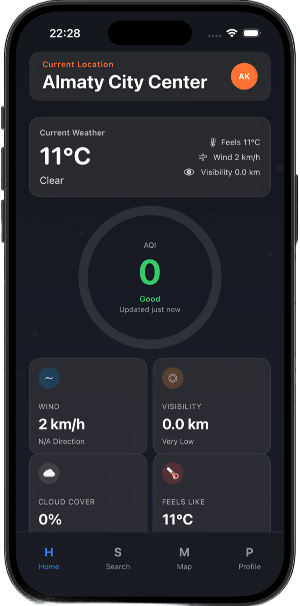
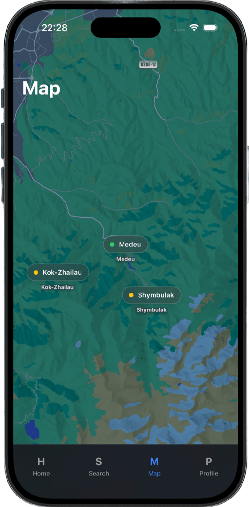

# 🏔️ Demal - Clean Air App

## 📖 О проекте

Алматы известен своими величественными горами, но в осенне-зимний период город часто накрывает плотный смог. **Demal** (от казахского *демалу* — дышать, отдыхать) — это iOS-приложение, созданное для мотивации жителей мегаполиса чаще выбираться на природу. 

Приложение в реальном времени мониторит качество городского воздуха (AQI) и предлагает идеальные локации высоко в горах (Медеу, Шымбулак, Кок-Жайляу), где прямо сейчас светит солнце и чистый воздух.

### 📸 Интерфейс приложения

| Главный экран (Live AQI) | Построение маршрута (MapKit) |
| :---: | :---: |
| 📱 *[Здесь будет вертикальный скрин твоего дашборда с виджетами]* | 🗺️ *[Здесь будет скрин карты с маршрутом до Медеу]* |
|  |  |

## ✨ Ключевые возможности

* **Live AQI Tracking:** Ежеминутный мониторинг уровня смога в городе (Open-Meteo).
* **Mountain Weather:** Актуальная погода, температура и облачность на горных пиках (Meteosource API).
* **Smart Navigation:** Интерактивная карта с возможностью построения автомобильного маршрута от пользователя до курорта (MapKit + CoreLocation).
* **Favorites Storage:** Сохранение любимых локаций в профиль для быстрого доступа.

## 🚀 Быстрый старт

**Требования:**
* Xcode 16.0+
* iOS 17.0+
* macOS для разработки

**Установка и запуск:**
1. Склонируйте репозиторий: `git clone https://github.com/Kissly1/Demal-App.git`
2. Перейдите в папку проекта: `cd Demal-App`
3. Откройте проект: `open Demal.xcodeproj`
4. Выберите симулятор (например, iPhone 17 Pro) и нажмите Cmd + R для запуска.

## 🏗️ Архитектура и Технологии

Проект построен на современной архитектуре **MVVM** с полным отказом от UIKit.

* **UI:** 100% SwiftUI с активным использованием Glassmorphism.
* **State Management:** Нативный макрос `@Observable` (iOS 17+).
* **Concurrency:** Swift 6 Concurrency (async/await, @MainActor, TaskGroups).
* **Data Safety:** `actor StorageManager` для потокобезопасного кэширования.
* **Map & Location:** Нативный iOS 17 Map API и MKDirections.

**Структура проекта:**
* `App/` — Точка входа и настройки окружения
* `Models/` — Codable структуры для парсинга API
* `ViewModels/` — Бизнес-логика экранов
* `Services/` — Сетевой слой и работа с геолокацией
* `Views/` — Экраны приложения и переиспользуемые UI-компоненты

## 🎨 Design System

* **Фон:** Темные оттенки (Dark Theme)
* **Акцент:** Оранжевый `rgb(1.0, 0.45, 0.2)`
* **Индикаторы воздуха:** Зеленый для чистого воздуха, красный/оранжевый для смога

## 🚧 Roadmap

**Phase 1: UI & Architecture** ✅
* MVVM сетап и дизайн-система
* SwiftUI верстка (Dashboard, Map, Profile)
* Настройка Swift 6 Concurrency

**Phase 2: Networking & Real Data** ✅
* Интеграция Meteosource API (Погода в горах)
* Интеграция Open-Meteo API (Live AQI в городе)
* CoreLocation для текущей позиции пользователя

**Phase 3: Features & Polish (В планах)** ⏳
* Push-уведомления при высоком уровне AQI
* Локализация (EN / RU / KZ)

## 👨‍💻 Разработчики

* **Alexander Kisslitsyn** * **Alikhan Amangeldiyev** 📍 Almaty, Kazakhstan 🇰🇿 | Май 2026
